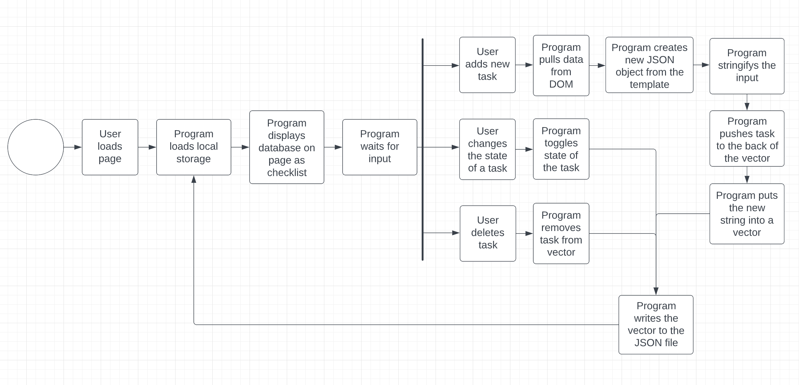
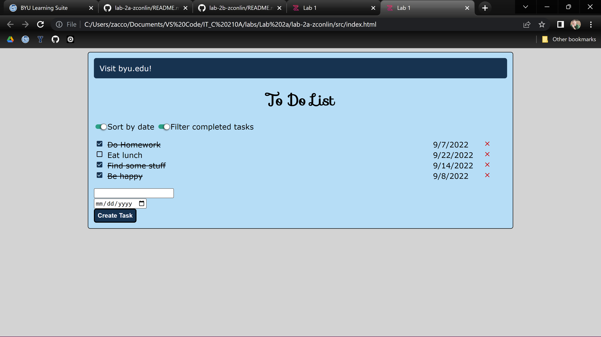
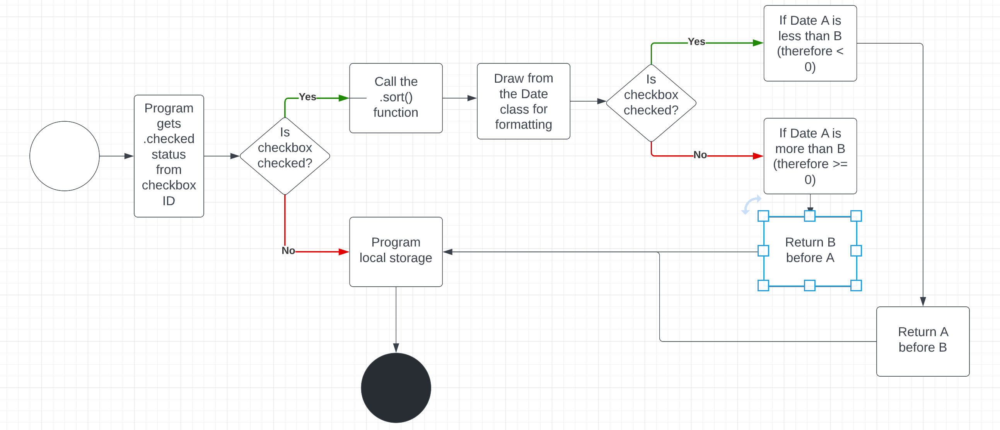
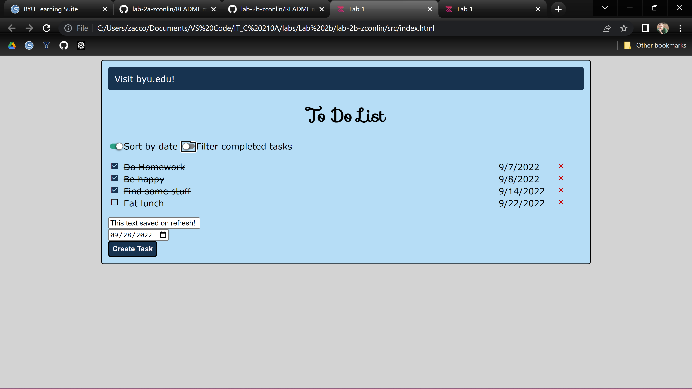
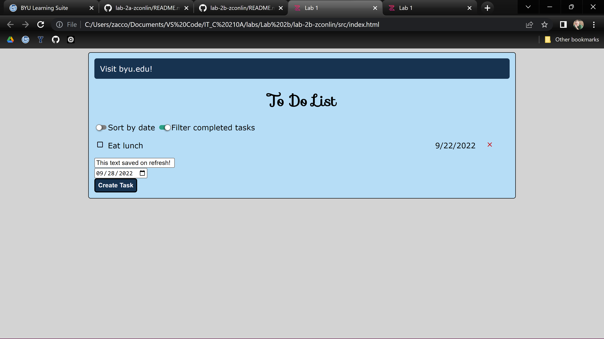

# Zac Conlin - 28 September - Lab 2

## II. Executive Summary (3 pts):
In this lab, I created functionality for my website, including the ability to add and remove tasks, check them off, and a sort and filter feature. I then saved these inputs into local storage so that they would be there the next time the user opens the webpage. I also sanitized my code for XSS attacks so that no javascript can be inserted into my page. 

## III. Design Overview (5 pts):

This lab built on the previous one, where we had wrote HTML and CSS for a webpage displaying a todo list. The objective for this one was to write the JavaScript and make the page functional. After building a Task class that creats a template for a user's new tasks, I moved on the creating and implementing the CRUD functions. In order to do this, I took in the user input and converted it into a string and then saved it to a JSON file. Using that information and the template in the Task class, I was able to draw in that input and display it to the screen. The UML Diagram below demonstrates the logic for how this works:

Using the CRUD functions, I implemented an updateStorage and a readStorage function in order to draw the inputs from the JSON file without being too complicated. By the end of these proceedings, my webpage was functional on a very basic level. I could add, remove, check off (which would also add a strikethrough on the task), and delete any task I wanted. As you can see, both the sort and filter buttons are checked but with no results.

The next step was to implement was to add functionality to my useless sort and filter buttons. This step was tricky, but I was able to use some higher-order functions in order to efficiently sort my tasks by the due date, and when the sort button was unchecked, sort by the time added. This process involved saving to local storage on the user's browser, and one extra thing I tried to do but was never able to fully accomplish without bugs was to add the state of the checkbox to the local storage so that when the page refreshes, the items stay sorted as they were. Here is the logic on the sort logic:

Once I had that part working, adjusting it to work for the filters wasn't too difficult, and now, when the filter switch is true, tasks that have been checked off will be hidden. I also, in order to protect my site from cross site scripting attacks, learned and implemented some code sanitizing measures that change the ASCII characters from the input box to HTML so that a user cannot inject their own code into my page. As a final step, I saved the text that the user is actively writing in the input text box to the local storage so it won't be lost on a page refresh, and also made the date default to today's date. Here is the final product of the webpage, with the sorted and filtered functionalites respectively being demonstrated:

## IV. Questions (4 pts):

### Lab2a Questions

*What are two differences and similarities between JavaScript and C++? (Think of differences and similarities that are more unique to these 2 languages not all languages in general)*
C++ is compiled and executed, versus in JavaScript, its scripts are interpreted. Javascript also lets the system control the memory management, whereas C++ makes the developer manage it themself.

*What is the difference between JSON and JavaScript objects?* 
JSON is created and used by other languages, and it can't hold functions. JavaScript, however, can contain functions and can make and use JSON, as we saw in this lab.

*If you open your web page in two different browsers, will changes on one appear on the other? Why or why not?* 
No, it will be different because the local storage is contained within the browser. So if you switch browsers, you lose access to the local storage from the other one.

*How long did you spend on this lab?*
I spent probably eighteen hours on this lab. I feel like it was poorly written and unclear what to do, there were many times that I was just stuck and didn't even know what outcome I should be working towards, so I din't know what questions to ask.

### Lab2b Questions

*How did you protect your site against Cross-Site Scripting? Which type of Cross-Site Scripting did you protect against?* 
I protected my site against Cross Site Scripting (XSS) by sanitizing the inputs from users by replacing their ASCII characters with their equivalents that are already in HTML.

*What is a Higher-Order Function?*
A higher order function can take functions in their parameters and can return a function.

*What are the differences between the oninput, onkeyup, and onchange events? When do they trigger, when might you use one over the others?* 
oninput triggers when a user writes something in an input box, onkeyup occurs when the designated key is lifted after being pressed, and onchange happens whenever the user changes the value of an element. You'd choose one of these depending on when you need the action to take place, for example, if the screen changed color after pressing the letter "o", then you would want onkeyup.

## V. Lessons Learned (4 pts):
*Problem 1*

The ToHTML function creates a template for each new task. This code takes the variables provided into the input boxes and converts them to the HTML elements. In order for the new HTML to be created with the new inputs, the variables are preceded by the characters: "${variable}". If the variables are not surrounded by these characters, they will just be hard coded into the new HTML.

*Problem 2*

During the code, there are several functions in the CRUD that need to call the readStorage()function. This function updates the array with the provided information. A problem arises, though, if you have a function that readStorage() calls call readStorage(). This will put the program into an infinite loop and ultimately will exceed the maximum stack size available. Pay attention to what functions call other functions.

*Problem 3*

In the prettyDate function it will return a date in the correct format, rather than the default yyyy-mm-dd format. A hitch that can cause issues in coding is that the time zone does not default to the time as a user would expect it, so date inputs can appear incorrectly. This is fixed by adding the date.getUTCDate parameter, and for the month, a +1 is required (otherwise January returns as 0, and February is month 1).

## VI. Conclusions (4 pts):

### Skills Acquired
- Code in Javascript
- Interact with objects in the DOM
- Read and Write to and from the local storage
- Parse data from a JSON file

### References
A great source of information on higher order functions: https://www.codecademy.com/learn/game-dev-learn-javascript-higher-order-functions-and-iterators/modules/game-dev-learn-javascript-iterators/cheatsheet#:~:text=In%20Javascript%2C%20functions%20can%20be,and%2For%20returns%20a%20function.

Helped me with almost all of my syntax questions and issues: https://www.w3schools.com 

Helped for the questions at the end of the lab: https://virteom.com/why-does-my-website-look-different-in-different-browsers#:~:text=It%20is%20okay%20that%20your,looks%20good%20and%20functions%20properly

